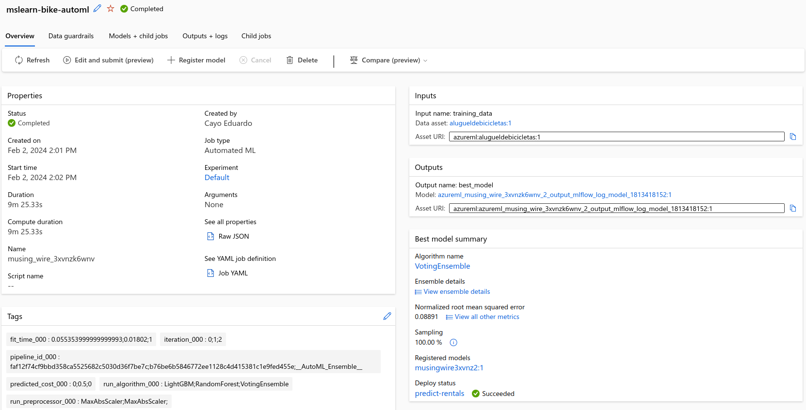

# dio-lab-azure-ml
Repositório do desafio DIO - Trabalhando com Machine Learning na Prática no Azure ML

Neste projeto nos implementação a criação de um modelo de previsão dos aluguéis de bicicletas utilizando a base de dados mslearn-bike-rental utilizando o serviço de Machine Learning do Azure.

## Passos para realização do desafio

- Seguindo as instruções https://microsoftlearning.github.io/mslearn-ai-fundamentals/Instructions/Labs/01-machine-learning.html

- Criamos um recurso Automated ML seguindo as instruções do link acima.
- Após a conclusão do treinamento, registramos o modelo e publicamos o mesmo como um serviço web.
- Testamos o serviço web utilizando um arquivo de dados de entrada (input.json).
- Ao final do teste o nos retora o resultado da previsão. (output.json)

